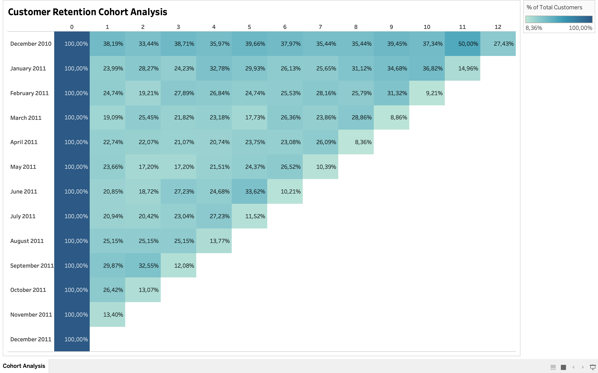

# Müştəri saxlanması üzrə kohort analizi

Bu layihədə 2010-cu ilin dekabrından 2011-ci ilin noyabrına qədər ilk alışını edən müştərilər aylıq kohortlara bölünüb. Hər kohortun sonrakı aylardakı alış aktivliyi izlənərək təkrar alış davranışı və müştəri saxlanması təhlil edilib.

## Analizin məqsədi

- İlk alışdan sonra müştərilərin aktivliyini izləmək
- Kohortların aylıq saxlanma göstəricilərini müqayisə etmək
- Təkrar alışın zəiflədiyi və artdığı dövrləri müəyyənləşdirmək
- Müştəri saxlanmasını yaxşılaşdırmaq üçün tövsiyələr hazırlamaq

## Metodologiya

Müştərilər ilk alış ayına görə qruplaşdırılıb. 0-cı ay kohortun yarandığı ayı, sonrakı sütunlar isə ilk alışdan sonra keçən ayların sayını göstərir.

**Saxlanma faizi = Müvafiq ayda alış edən müştərilərin sayı / Kohortun ilkin müştəri sayı × 100**

Analiz aşağıdakı mərhələlər üzrə aparılıb:

1. Hər müştərinin ilk alış tarixinin müəyyənləşdirilməsi
2. Müştərilərin ilk alış ayına görə kohortlara bölünməsi
3. Alış tarixi ilə kohort tarixi arasındakı ay fərqinin hesablanması
4. Hər kohort üzrə aylıq saxlanma faizinin hesablanması
5. Nəticələrin istilik xəritəsində vizuallaşdırılması

## Vizualizasiya

## Əsas nəticələr

| Göstərici | Nəticə |
| --- | ---: |
| Təhlil edilən kohort sayı | 12 |
| Birinci ay üzrə orta saxlanma | 24,09% |
| Birinci ay üzrə ən yüksək nəticə | Dekabr 2010 - 38,19% |
| Birinci ay üzrə ən aşağı nəticə | Noyabr 2011 - 13,40% |
| On ikinci aya çatan kohortun nəticəsi | Dekabr 2010 - 27,43% |
| 0-cı aydan sonrakı ən yüksək göstərici | Dekabr 2010, 11-ci ay - 50,00% |

## Analitik nəticələr

- **İlk ayda kəskin azalma var:** Birinci ay üzrə saxlanma 13,40%-38,19% aralığındadır. Kohort faizlərinin sadə ortası 24,09%-dir. Bu, müştərilərin böyük hissəsinin alışdan sonrakı ayda təkrar alış etmədiyini göstərir.

- **Dekabr 2010 kohortu daha sabitdir:** Bu kohort ikinci aydan onuncu aya qədər əsasən 33%-40% aralığında qalıb, 11-ci ayda 50%-ə yüksəlib və 12-ci ayı 27,43%-lə tamamlayıb.

- **Aktivlik yalnız azalan istiqamətdə dəyişmir:** Yanvar 2011 kohortu birinci aydakı 23,99%-dən onuncu ayda 36,82%-ə, iyun 2011 kohortu isə birinci aydakı 20,85%-dən beşinci ayda 33,62%-ə yüksəlib. Bu dəyişikliklər yenidən aktivləşmə və ya mövsümi alış davranışına işarə edə bilər.

- **Noyabr ayında ümumi artım görünür:** Fərqli kohortların 2011-ci ilin noyabrına uyğun gələn göstəriciləri əvvəlki aylardan əsasən yüksəkdir. Səbəbi dəqiqləşdirmək üçün həmin dövrün məhsul, satış və kampaniya məlumatları ayrıca yoxlanmalıdır.

- **Son ay üzrə nəticələr ehtiyatla şərh edilməlidir:** Əksər son diaqonal hüceyrələrin 8,36%-14,96% aralığında olması məlumat dəstindəki son ayın natamam ola biləcəyini göstərir. Bu dövr tam ay deyilsə, nəticələr ümumi saxlanma göstəricisi kimi qəbul edilməməlidir.

- **Yeni və köhnə kohortlar eyni müddət üzrə müqayisə edilə bilməz:** Yeni kohortların müşahidə müddəti daha qısadır. Buna görə uzunmüddətli müqayisə yalnız eyni kohort yaşı üzrə aparılmalıdır.

## Tövsiyələr

- İlk alışdan sonrakı 30 gün üçün fərdiləşdirilmiş kommunikasiya qurmaq
- Birdəfəlik və təkrar alış edən müştəriləri ayrıca təhlil etmək
- Dekabr 2010 kohortunun və noyabr ayındakı artımın səbəblərini araşdırmaq
- Müştəriləri məhsul, ölkə və cəlbetmə kanalına görə əlavə seqmentlərə bölmək
- Natamam son ayı analizdən çıxarmaq və ya vizualda ayrıca işarələmək

## İzlənəcək göstəricilər

- Birinci, üçüncü, altıncı və on ikinci ay üzrə saxlanma faizi
- Təkrar alış faizi
- Yenidən aktivləşmə faizi
- Kohort üzrə aktiv müştəri sayı

## Fayl

[Tableau workbook-u yüklə](customer-retention-cohort-analysis.twbx)

## İstifadə olunan alətlər

- **Tableau** - kohortların yaradılması, saxlanma faizlərinin hesablanması və istilik xəritəsinin hazırlanması

> Bu layihə tədris və portfel məqsədilə hazırlanmış konseptual analizdir.

## Bacarıqlar

`Cohort Analysis` · `Customer Retention` · `Tableau` · `Data Visualization`
